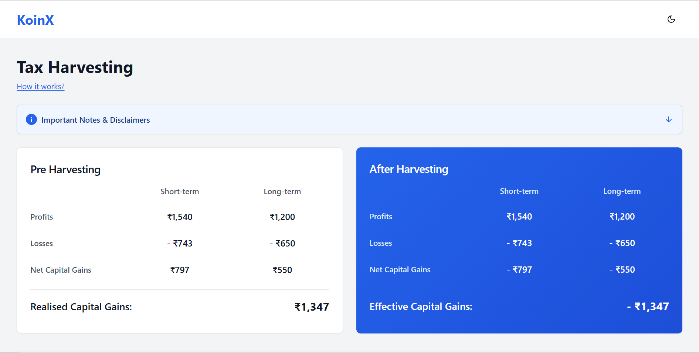
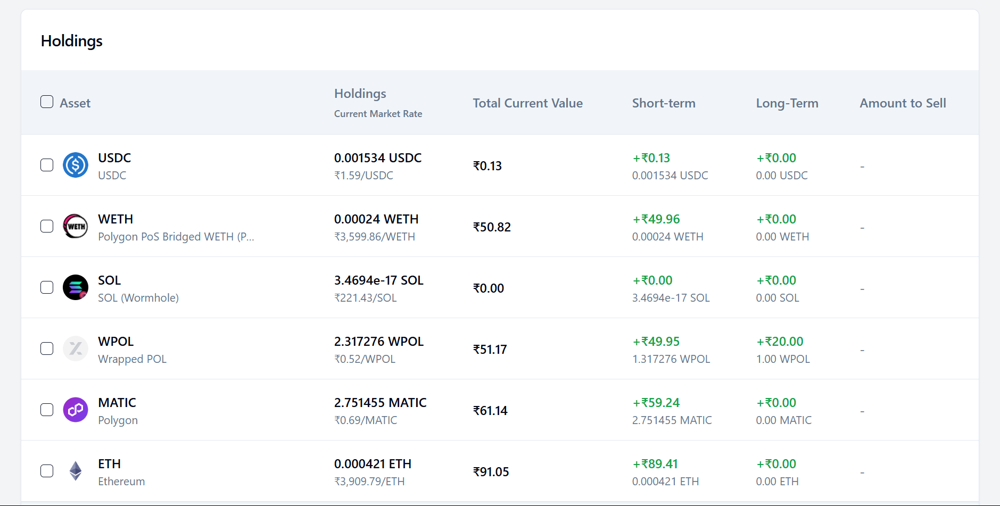

# 📉 Tax Loss Harvesting Tool (React + Mock APIs)

A fully functional frontend tool for simulating **Tax Loss Harvesting** strategies, built using **React**, **Tailwind CSS**, and **mock APIs**. This project visualizes holdings, calculates capital gains/losses, and allows users to simulate sell actions for optimized tax outcomes.

## ✅ Status

**Project Completed** – All UI components, logic, and mock integrations have been implemented successfully. Ready for demo, testing, or future API integration.

## 🚀 Features

- 📊 Real-time portfolio visualization
- 🧮 Automatic capital gain/loss computation
- 💡 Tax loss harvesting suggestions
- 🔄 Simulated sell actions with UI feedback
- 🧪 Mock APIs used for portfolio and price data
- ✨ Clean UI with Tailwind CSS + shadcn UI components

## 🛠️ Tech Stack

- **React** (with Vite)
- **Tailwind CSS**
- **shadcn/ui**
- **Lucide React Icons**
- **Mock Service Worker (MSW)** or custom mock API (if applicable)

## 📸 Screenshots

| Holdings View                         | Harvesting Actions                        |
| ------------------------------------- | ----------------------------------------- |
|  |  |

## 📂 Folder Structure
